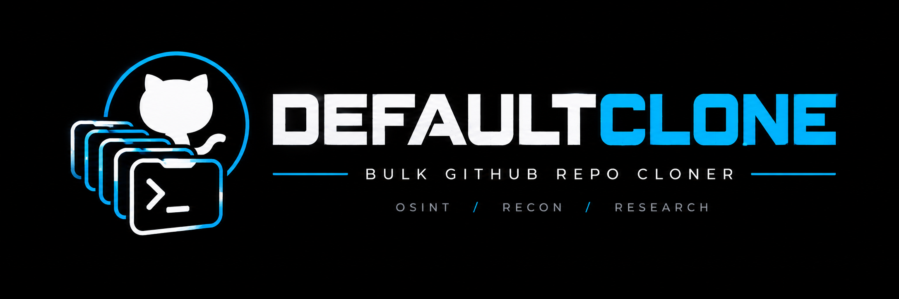

<p align="center">
  
</p>

<p align="center">
  Bulk GitHub repository cloner for OSINT / recon use.
</p>

Given a GitHub username or organization name, Defaultclone:

1. Fetches **all** public (and optionally private) repositories
2. Prints a repo count + estimated time
3. Clones everything concurrently with a live Rich progress bar
4. Writes `report.json` and `report.log` summarising the run

---

## Requirements

- Python 3.11+
- `git` in `PATH`

---

## Installation

```bash
git clone https://github.com/defaultsecc/defaultclone
cd defaultclone
pip install -r requirements.txt
```

---

## First Run — Token Setup

On first launch, Defaultclone will prompt you for a GitHub Personal Access Token if none is saved:

```text
[!] No GitHub token found.
    Without a token you are limited to 60 API requests/hour.
    Press Enter to skip, or paste a token to save it.
  Token (Enter to skip):
```

Your token is stored at `~/.defaultclone/config.json` with permissions `600` (owner-read/write only on POSIX). It is **never** printed to the terminal or written to report files.

To generate a token: [https://github.com/settings/tokens](https://github.com/settings/tokens) — classic token with `repo` scope is sufficient.

---

## Usage Examples

```bash
# Clone all public repos for a user
python defaultclone.py torvalds

# Clone all repos for a GitHub org
python defaultclone.py microsoft

# Include forked repos
python defaultclone.py someuser --include-forks

# Shallow clone (last 1 commit only, much faster)
python defaultclone.py someorg --depth 1

# Custom output directory
python defaultclone.py someuser --output /data/recon

# Skip confirmation prompt
python defaultclone.py someuser --yes

# Dry-run (list repos, don't clone)
python defaultclone.py someuser --dry-run

# Increase parallelism (max 10)
python defaultclone.py someorg --concurrency 10

# Use a token just for this run (not saved)
python defaultclone.py someuser --token ghp_xxxx

# Use environment variable (not saved)
GITHUB_TOKEN=ghp_xxxx python defaultclone.py someuser

# Use env/flag token AND save it
python defaultclone.py someuser --token ghp_xxxx --save-token
```

---

## Token Management

| Command | Effect |
| ------------------------------------ | ------------------------------------ |
| `python defaultclone.py --set-token` | Re-prompt and overwrite saved token |
| `python defaultclone.py --logout` | Delete the saved token |
| `--token TOKEN` | Override for this run only |
| `GITHUB_TOKEN=xxx` | Override via env var (this run only) |
| `--token TOKEN --save-token` | Override and persist |

---

## Flag Reference

```text
positional:
  target                GitHub username or organization name

token management:
  --token TOKEN         One-time token override (not auto-saved)
  --save-token          Persist the provided/entered token
  --set-token           Force re-prompt, overwrite saved token
  --logout              Delete saved token

clone options:
  --output DIR          Output base directory (default: ./cloned)
  --concurrency N       Parallel clone threads (default: 5, max: 10)
  --depth N             Shallow clone depth (default: full clone)
  --include-forks       Include forked repos (default: excluded)
  --retry N             Retry failed clones N times (default: 1)

behaviour:
  --dry-run             List repos and count; don't clone
  --yes, -y             Skip confirmation prompt
```

---

## Output Structure

```text
cloned/
└── <target>/
    ├── repo-one/          ← cloned repo
    ├── repo-two/
    ├── …
    ├── report.json        ← machine-readable summary
    └── report.log         ← human-readable log
```

`report.json` contains clone status per repo (cloned / skipped / failed with reason). Your token **never** appears in these files.

---

## Post-Clone Secret Hunting

Once all repositories have been cloned, the `cloned/` directory can be searched for potentially exposed API keys, tokens, credentials, and private keys.

These commands are intended to reduce manual effort when reviewing a large number of repositories during authorized security research.

> **Note:** These searches identify potential secret candidates and may produce false positives. Always manually verify findings and only test credentials within the scope and authorization of the relevant bug-bounty program.

### API Keys, Tokens & Secrets

```bash
grep -rniE --exclude-dir=.git \
'(^|["'\''])(api[_-]?key|apikey|api[_-]?token|access[_-]?token|auth[_-]?token|secret|client[_-]?secret|private[_-]?key)["'\'']?[[:space:]]*[:=][[:space:]]*["'\'']?[A-Za-z0-9_./+=-]{8,}' \
cloned/
```

### Cloud & Service Credentials

```bash
grep -rniE --exclude-dir=.git \
'(AWS_ACCESS_KEY_ID|AWS_SECRET_ACCESS_KEY|AZURE_CLIENT_SECRET|AZURE_TENANT_ID|GOOGLE_APPLICATION_CREDENTIALS|GITHUB_TOKEN|GITLAB_TOKEN|SLACK_TOKEN|STRIPE_SECRET_KEY|OPENAI_API_KEY)[[:space:]]*[:=][[:space:]]*["'\'']?[A-Za-z0-9_./+=-]{8,}' \
cloned/
```

### Environment Credentials

```bash
grep -rniE --exclude-dir=.git \
'^[A-Za-z0-9_]*(KEY|TOKEN|SECRET|PASSWORD|PASS|CREDENTIAL)[A-Za-z0-9_]*[[:space:]]*=[[:space:]]*[^[:space:]#]{4,}' \
cloned/
```

### Private Keys

```bash
grep -rniE --exclude-dir=.git \
-- '-----BEGIN (RSA |EC |OPENSSH |DSA )?PRIVATE KEY-----' \
cloned/
```

### Recommended Workflow

```text
GitHub Account / Organization
            |
            v
       Defaultclone
            |
            v
     Repository Discovery
            |
            v
      Clone Repositories
            |
            v
          cloned/
            |
            v
      Secret Hunting
            |
            v
     Manual Verification
            |
            v
    Authorized Reporting
```

Simple pattern matching can produce false positives, including example values, test credentials, documentation, variable names, and placeholder values.

For example:

```text
API_KEY=""
API_KEY=false
API_KEY=null
API_KEY="your-api-key"
```

should not automatically be treated as valid credentials.

Always inspect the surrounding context and determine whether a finding contains a real, potentially sensitive value before considering it a security finding.

Do not publish or commit discovered credentials. Keep sensitive values redacted when sharing findings, screenshots, or reports.

---

## Architecture

| File | Responsibility |
| ----------------- | --------------------------------------------- |
| `defaultclone.py` | Entry point, CLI parsing, orchestration |
| `auth.py` | Token prompt, save/load/validate, config |
| `github_api.py` | Repo listing, pagination, rate-limit handling |
| `cloner.py` | Threaded git clone, retry, skip logic |
| `ui.py` | Rich banner, progress bar, tables, theme |
| `report.py` | Writes `report.json` / `report.log` |

---

## Rate Limits

| Scenario | Limit |
| ---------- | --------------------- |
| No token | 60 requests / hour |
| With token | 5 000 requests / hour |

If you hit the limit, Defaultclone prints the reset time and suggests adding a token.

---

## Legal / Ethics

This tool is for authorized security research, OSINT, and archival purposes only. Only target accounts and repositories you have permission to access. The authors accept no responsibility for misuse.
